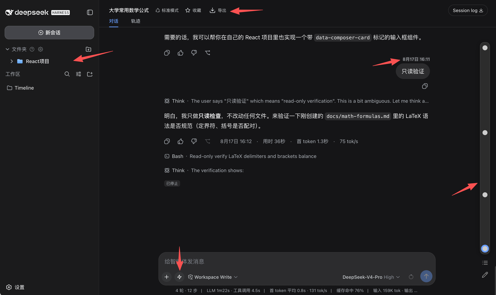

# DSH Timeline

**An all-in-one productivity plugin for [DeepSeek Harness](https://deepseek-harness.github.io/deepseek-harness/) conversations**

Timeline navigation · Starred folders · Prompt library · Conversation export · Formula copy

[简体中文](./README.md) | **English**

## 📖 What is DSH Timeline?

DSH Timeline is a feature-enhancement plugin for [DeepSeek Harness](https://deepseek-harness.github.io/deepseek-harness/).

Once an AI conversation gets long, finding things becomes a chore: revisiting a question means endless scrolling, key takeaways get scattered across sessions, and formulas or content are hard to take with you. DSH Timeline was built for exactly this — it renders a visual timeline beside the conversation so you can jump anywhere in one click, and rounds out the workflow with starred folders, pin markers, quick notes, a prompt library, and multi-format export: find it, note it, organize it, take it with you.

The plugin blends right into the host UI: it follows the light / dark theme in real time, ships with an English / Chinese interface, and every feature can be toggled independently — install it and go, without disrupting your habits.

## ✨ Features

- 🧭 **Timeline navigation** — a rail on the right maps every question; click to jump, with a compact mode, virtualized rendering, and `↑` / `↓` shortcuts
- 📌 **Key-point markers** — long-press a timeline node to pin it, so important questions stand out
- 📋 **Question list** — numbered list of all questions, active row follows your reading position
- ⭐ **Starred folders** — file whole conversations, single questions, and notes into two-level folders; drag to organize, pin, and search
- 📝 **Notepad** — a draggable, resizable quick-notes panel for capturing ideas
- 💬 **Prompt library** — save frequently used prompts and insert them from beside the composer in one click
- ⌨️ **Smart input** — `Enter` for a newline, double-`Enter` to send; quote selected text as a follow-up; keep your reading position after sending
- 📤 **Conversation export** — Markdown / TXT / JSON / CSV / PNG / PDF, with math formulas rendered as usual
- 🧮 **Formula copy** — click a formula to copy it as LaTeX or MathML, ready to paste into Word
- 🔔 **Reply alerts** — toast and optional sound when a reply finishes while you are reading earlier messages
- 💾 **Data backup** — one-click export / import of all plugin data (JSON)
- 🎨 **Native feel** — follows the host's light / dark theme, English / Chinese UI, per-feature toggles

## ⭐ Support

If Timeline helped you, share it with your friends — and a GitHub Star helps more people discover it!

## 📄 License

This project is open-sourced under the [GPL-3.0-or-later](./LICENSE) license.

You are free to use, study, modify, and distribute this project, but derivative works must be released under the same license and keep the original copyright notice. Please make sure your usage complies with the license before any commercial use.
